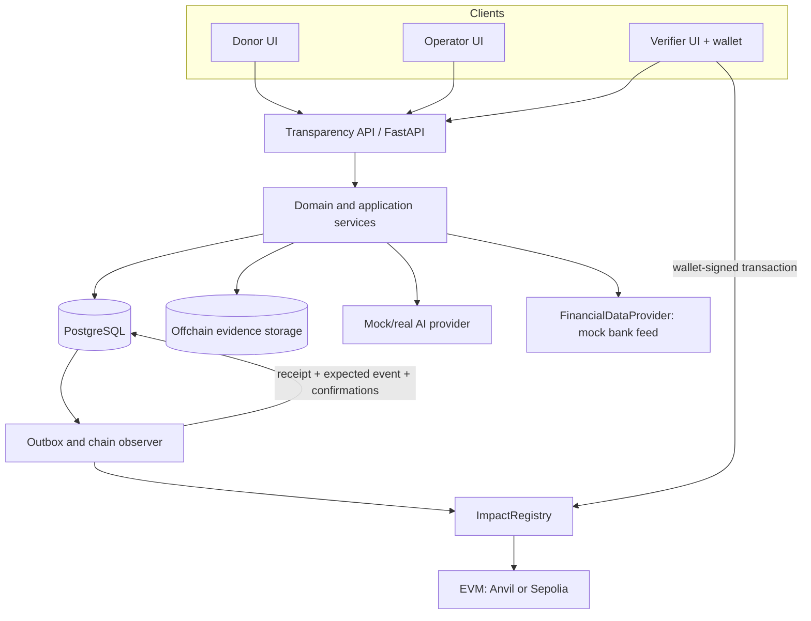

# Architecture

ImpactGraph separates claims about the real world from evidence that a named actor made
those claims. PostgreSQL is the workflow/indexing store; Ethereum is the immutable
commitment and attestation authority; neither replaces the other.

## Authority boundaries

- `ImpactRegistry` authorizes blockchain actors and rejects duplicate/unknown entities.
- Domain services authorize application personas and validate lifecycle transitions.
- Claim verification is decided by `VerificationPolicyService`, reached through
  `verification.evaluate_persisted_claim` from both the durable path
  (`worker._confirm_verifier_attestation`) and the read model (`read_model.verification`),
  so one requirement list governs both. No AI, reconciliation result, operator action or
  frontend assertion can produce VERIFIED on any path, and a claim that was verified and
  then fails a requirement is lowered to CHALLENGED rather than left reading as verified.
- The AI provider proposes typed facts; it never changes a claim to VERIFIED.
- The verifier signs a deterministic bundle containing the exact reviewed claim/evidence.

## Core flows

Backend-originated chain writes use a transactional outbox: persist intent, audit entry,
blockchain operation, and job atomically; submit later; verify the receipt/event; then
advance domain state. Wallet-originated writes begin with a backend intent, are submitted
by the wallet, and are independently observed by the backend. Frontend assertions are not
trusted.

Evidence storage hashes exact uploaded bytes before processing. Registered objects are
immutable, and integrity verification re-reads the stored object and rehashes it. Derived
artifacts would carry separate hashes; no derivation step exists yet. Corrections are
modelled as a new evidence record plus a SUPERSEDES edge, but no code path writes one.

## Security assumptions

The POC has upload limits and type validation, ORM queries, opaque onchain IDs, and
environment-held secrets. Operators, verifiers and administrators authenticate with an
email and password hashed with Argon2id, against revocable server-side sessions, and the
role comes from the account rather than from a request header. Wallet control is proven by
signature over a single-use server-issued nonce, not asserted. Operator mutations and
INTERNAL evidence are scoped to the caller's organisation. See [security](security.md) and
ADR-005. Local Anvil accounts are unsafe outside local development. Production identity proofing, fine-grained document IAM, KYC/AML, HSM-backed
keys, and hardened job infrastructure are not implemented.

## Financial records

Money is an integer count of minor units plus an ISO currency, in two columns, never a
float and never a single string. Funding, allocations, observed payments, deliveries and
outcomes are typed records.

ImpactGraph observes financial activity; it does not initiate it. `FinancialDataProvider`
is a read-only feed, imported idempotently by provider reference. The allocation is a
spending ceiling: an import that would exceed the remaining balance is rejected, so the
ledger cannot report spend the program never committed to.

Evidence reconciliation resolves its counterparts from these records rather than from
values supplied by the caller, which is what makes a mismatch meaningful.

## Future evolution

Likely extensions include verified organization credentials, payment-provider adapters,
multiple/threshold verifiers, public verification APIs, privacy-preserving disclosure,
external auditors, alternative evidence stores, and carefully versioned additional EVM
networks. None are required for the POC.

