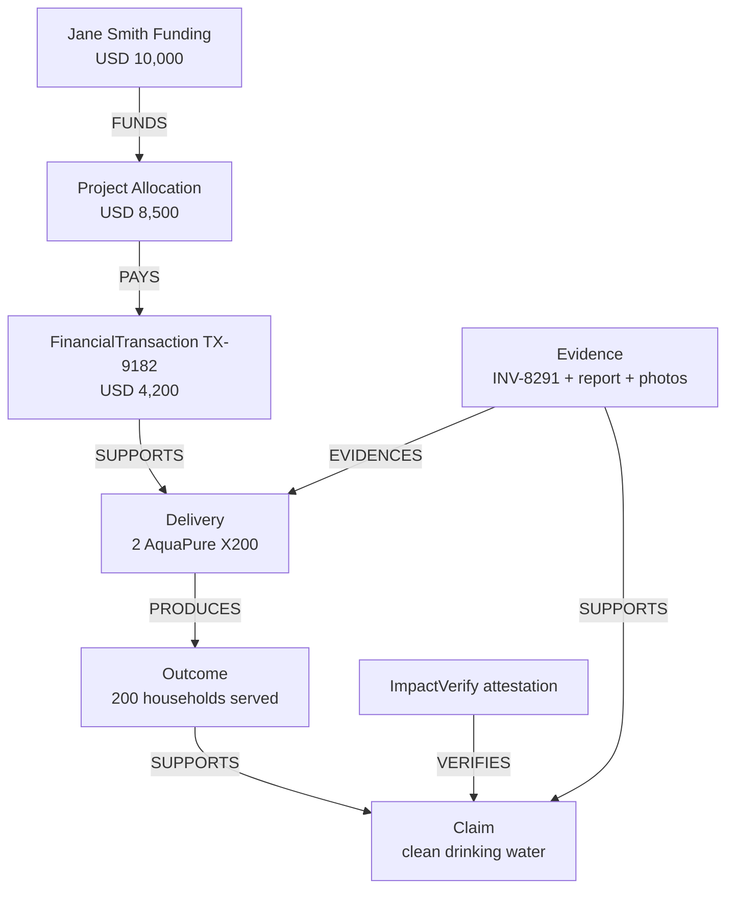

# Provenance model

The graph is an append-only set of typed entities and directed assertions. A confirmed
edge is historical; a correction adds a replacement entity and `SUPERSEDES` edge.

Entities are Program, Funding, Allocation, FinancialTransaction, Delivery, Evidence,
Attestation, Outcome, and Claim. Ethereum receives opaque stable IDs and commitments—not
Jane Smith's name, beneficiary identities, documents, or extracted sensitive content.

Allowed relationship vocabulary is FUNDS, ALLOCATES_TO, PAYS, SUPPORTS, EVIDENCES,
DELIVERS, ATTESTS, VERIFIES, PRODUCES, and SUPERSEDES. `ImpactRegistry` validates valid
source/target combinations and rejects duplicate edges. Application queries return
renderable nodes plus edges; the flagship UI intentionally lays out the golden path.

Of the ten relationships, the seeded graph uses FUNDS, PAYS, SUPPORTS, EVIDENCES and
PRODUCES. `ALLOCATES_TO`, `DELIVERS`, `ATTESTS`, `VERIFIES` and `SUPERSEDES` are defined in
the contract and the vocabulary but are not written by any code path yet, so the `VERIFIES`
edge shown above is not created when a verifier attestation confirms.

An attestation records that one identified wallet asserted a statement about a subject at
a time. It does not establish objective truth. Revocation adds an event and status; it does
not erase the assertion.

