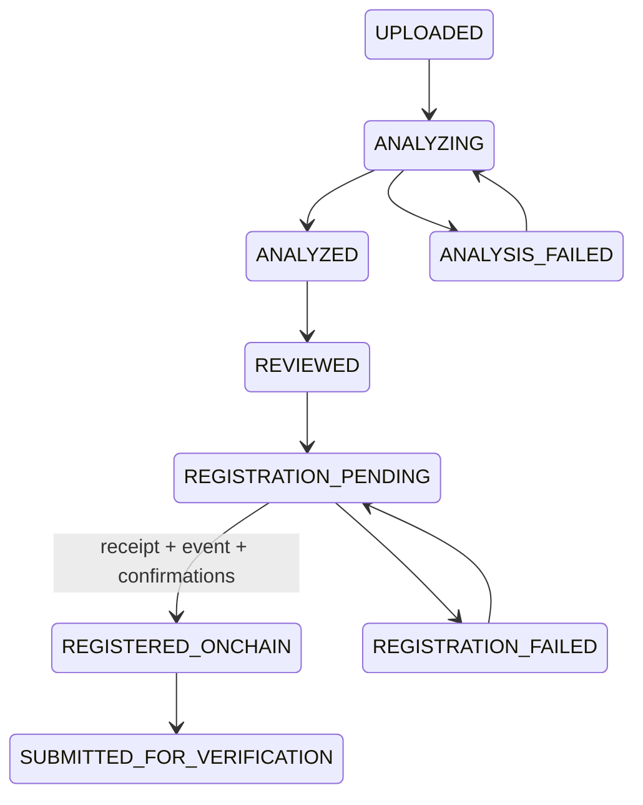
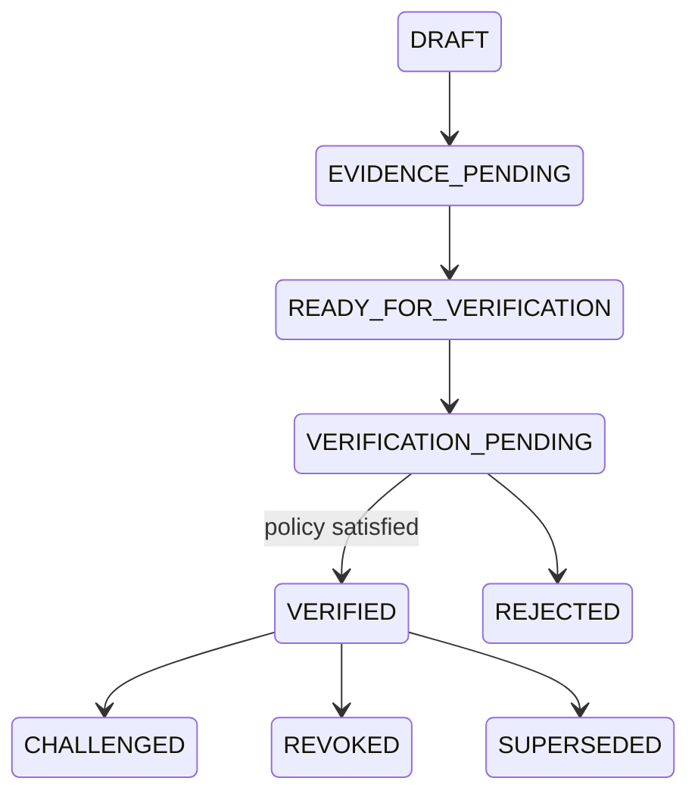
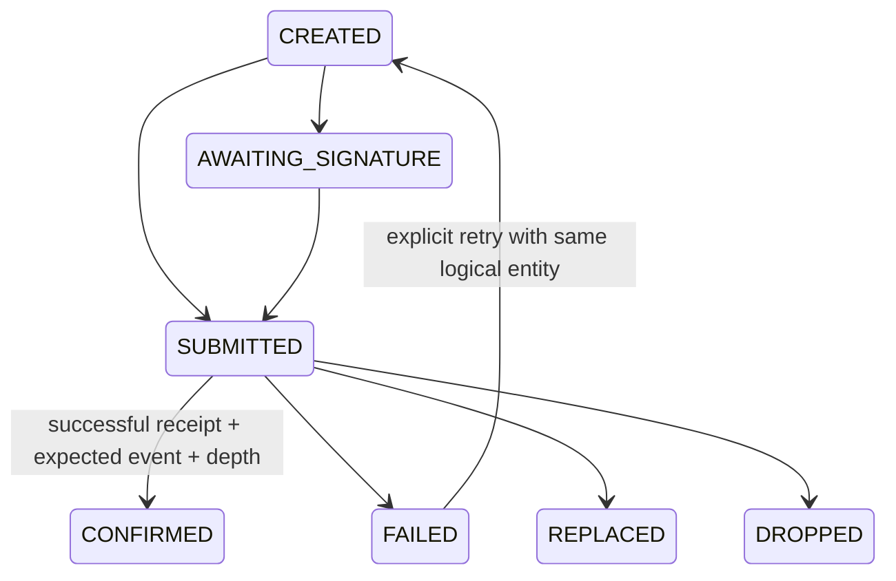

# State machines

## Evidence

Workflow, analysis, integrity, and blockchain status remain separate fields.

## Claim

AI confidence, reconciliation, operator review, transaction submission and UI expectations
cannot produce VERIFIED. The transition is made only after the backend independently
observes a successful receipt, the expected `AttestationCreated` event emitted by the
configured registry, the committed verification-bundle hash matching the claim's current
bundle, and the configured confirmation depth.

The transition tables above are declared in `impactgraph/domain.py` but are not yet the
code path production takes: status writes are currently direct assignments guarded
individually, and `transition_claim`/`transition_evidence` have no caller outside tests.
Collapsing the writes onto them is outstanding work. `VerificationPolicyService` *is*
wired into both the durable path and the read model, through
`verification.evaluate_persisted_claim`.

For wallet verification, the backend persists `AWAITING_SIGNATURE`; the browser records a
transaction hash as `SUBMITTED`; the chain observer validates receipt, expected
`AttestationCreated`, and confirmation depth. Only then does backend policy evaluate the
current bundle and potentially transition the claim to VERIFIED.

## Blockchain operation

REPLACED and DROPPED are defined but not yet assigned by any code path, and retry currently
re-submits an operation rather than transitioning it back to CREATED.

## Attestation

Attestations are AWAITING_SIGNATURE → SUBMITTED → CONFIRMED, with FAILED when the observed
receipt, event, bundle hash or attestation type does not match the intent. A withdrawal creates a separate
revocation event; a replacement creates a new attestation and supersession relationship.
Confirmed assertion fields are never edited.
